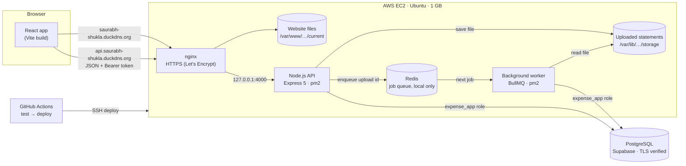
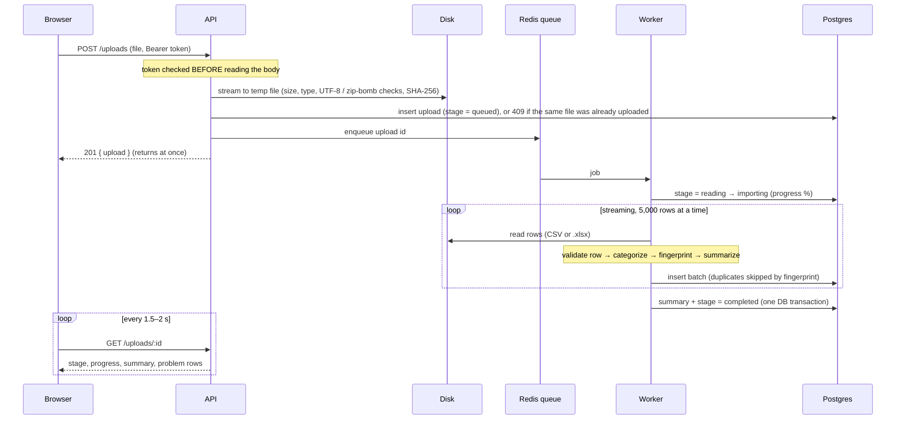
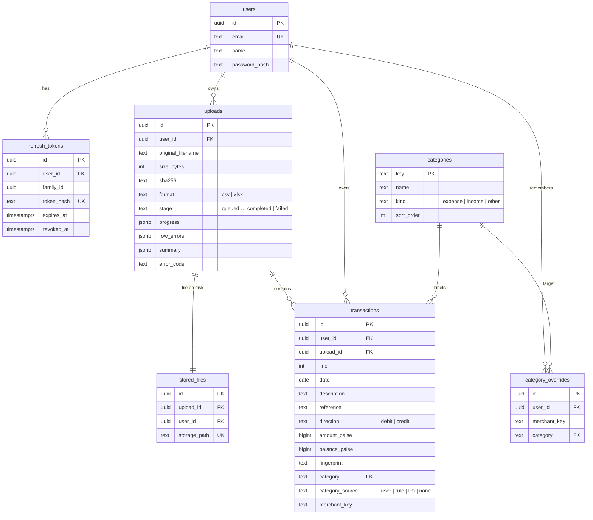

# Expense Tracker — Fintech Expense Classification & Reporting Tool

Upload your bank statements (CSV or Excel), and the app sorts every
transaction into categories, checks the statement adds up, and shows where
the money went — by category, merchant and time period — with CSV and PDF
exports.

**Live:** https://saurabh-shukla.duckdns.org (API: https://api.saurabh-shukla.duckdns.org/health)

Sample statements to try it with: [`backend/tests/fixtures/statements/`](backend/tests/fixtures/statements/)
(HDFC, SBI, ICICI, Axis, Kotak — synthetic data; `.xlsx` versions in `xlsx/`).

## Contents

1. [What it does](#1-what-it-does)
2. [Architecture](#2-architecture)
3. [Backend design: schema and API](#3-backend-design-schema-and-api)
4. [Technology stack](#4-technology-stack)
5. [Edge cases and testing](#5-edge-cases-and-testing)
6. [Setup, running and testing](#6-setup-running-and-testing)
7. [Deployment](#7-deployment)
8. [Self-assessment](#8-self-assessment)
9. [Further documentation](#9-further-documentation)

---

## 1. What it does

| Requirement | How it's met |
|---|---|
| Home page | A landing page for visitors (how it works, supported banks, how the data is protected), with sign-up and login. |
| Authentication | Sign-up, login, logout. Short-lived access token (15 min, in memory) + rotating refresh token in an httpOnly cookie, with reuse detection. |
| Upload | Drag-and-drop or file picker, several files at once, upload progress bar. CSV and `.xlsx`, up to 10 MB each. |
| Parse, categorize, store | Recognises the column layouts of 5 Indian banks; validates every row; categorizes with rules plus the user's own corrections; stores in PostgreSQL. Runs in a background worker; the page shows live progress. |
| Dashboard | Money in / out / net, a money-in-and-out chart per day / week / month (with a table view), spending by category, top merchants. Filters: period presets or custom dates, category. Responsive; light and dark themes with a switch on every page (remembered on the device, otherwise follows the system). |
| Corrections | Change a transaction's category; optionally "always" for that merchant (re-labels past transactions and future uploads). Rules page to review and remove them. |
| Export | CSV of the filtered transactions (streamed, any size) and a PDF report (summary, category chart, tables). |
| Errors and edge cases | Malformed/corrupt files, duplicates and overlapping statements, session expiry mid-upload, large files — see [section 5](#5-edge-cases-and-testing). |

Also: every statement's running balance is cross-checked row by row, and
gaps (rows that couldn't be read) are pointed out with their line numbers.

## 2. Architecture



**Request path.** The browser loads the website from
`saurabh-shukla.duckdns.org` and calls the API at
`api.saurabh-shukla.duckdns.org`. nginx terminates HTTPS for both and
forwards API calls to Node on `127.0.0.1:4000` (ports 4000 and 6379 are
closed to the internet). Both names are under one registrable name, so the
browser treats them as one *site* and the `SameSite=Lax` refresh cookie
works.

**What happens to an upload:**



**Key decisions** (full list with reasons: [`docs/DECISIONS.md`](docs/DECISIONS.md), D1–D39):

- **Upload returns immediately; a worker does the work.** Parsing a large
  statement can take a minute; the user gets an id at once and watches
  progress. Postgres is the source of truth for the stage; Redis is only the
  to-do list, and a periodic sweep re-queues anything Redis lost.
- **One streaming pass with flat memory.** Rows are checked, categorized and
  inserted in batches, all in one database transaction: a file that breaks
  on its last line leaves nothing behind. 200,000 rows: the reader stays at
  ~76 MB (it was 425 MB before streaming).
- **Money as integer paise** everywhere (`bigint`), never floating point;
  dates as plain `YYYY-MM-DD` strings (a statement date has no time zone).
- **Categorization in layers, never guessing:** the user's own rule for the
  merchant → type rules (cash, salary, interest, SIP, rent) → merchant
  keywords → transfer rules → *Uncategorized*. Rules use whole-word matches
  and the transaction direction.
- **Duplicates by fingerprint:** date + direction + amount + bank reference +
  running balance (description only as a fallback), with an occurrence
  number so two genuine identical payments on one day both stay.
- **Same filters everywhere:** one filter definition drives the transaction
  list, the dashboard and the exports, so what you see, chart and download
  are always the same rows.

**Security considerations:**

| Area | Measure |
|---|---|
| Passwords | bcrypt (cost 12), 72-byte limit enforced, identical answer and timing for "no such user" and "wrong password" |
| Sessions | Access token only in memory (never localStorage); refresh token httpOnly, `Secure`, `SameSite=Lax`, stored hashed, rotated on use; reuse of an old one revokes the whole session; refreshes serialized across tabs (Web Locks) |
| Authorization | Every query filtered by `user_id`; another user's resource is a 404, same as a missing one |
| Input | Zod validation of every body and query (strict: unknown parameters rejected); one error shape `{ error: { status, code, message, details, requestId } }` |
| Files | Streamed with size limits, rejected if empty / not UTF-8 / binary; `.xlsx`: zip-bomb and entry-size checks, no DOCTYPE (no XML entity tricks), old `.xls` refused |
| Database | App connects as a limited role (`expense_app`: rows only, no DDL); row-level security on every table blocks Supabase's public API; TLS verified against Supabase's CA |
| Network | HTTPS only (HSTS), CORS allow-list with other origins refused outright, rate limits (login 10/15 min per IP), real client IP only from nginx |
| Browser | Content-Security-Policy (scripts and network only to this site and the API), no framing, `nosniff`, strict referrer policy |
| Exports | CSV formula injection neutralised (`=HYPERLINK(…)` stays text); `Cache-Control: no-store` |

## 3. Backend design: schema and API

### Database schema (PostgreSQL)



Notable constraints:

- `transactions UNIQUE (user_id, fingerprint)` — the same real transaction is
  stored once per user, even across overlapping statements.
- `uploads UNIQUE (user_id, sha256) WHERE stage <> 'failed'` — the exact same
  file can't be imported twice, but a failed one can be retried.
- `transactions (upload_id, user_id) → uploads (id, user_id)` — a transaction
  can never claim a different owner than its upload.
- `category_overrides UNIQUE (user_id, merchant_key)` — one rule per merchant.
- Indexes for the hot paths: `(user_id, date)`, `(user_id, merchant_key)`,
  `(upload_id)`, `(user_id, created_at DESC)` on uploads.
- 17 fixed categories (seeded by migration 008), e.g. Food & Dining,
  Groceries, Transport, Fuel, Shopping, Bills & Utilities, Rent & Housing, Investments,
  Cash Withdrawal, Salary, Money Received, Uncategorized.

Schema changes are plain SQL migrations in
[`backend/src/db/migrations/`](backend/src/db/migrations/) (001–011), applied
by `npm run migrate` and tracked in `schema_migrations`.

### REST API

All responses are JSON unless noted. Authenticated routes need
`Authorization: Bearer <access token>`. Errors always look like
`{ "error": { "status", "code", "message", "details", "requestId" } }`.

| Method | Path | Auth | Purpose |
|---|---|---|---|
| GET | `/health` | — | Liveness check |
| POST | `/auth/signup` | — | `{ name, email, password }` → 201 `{ user }` |
| POST | `/auth/login` | — | `{ email, password }` → `{ user, accessToken, expiresIn }` + refresh cookie |
| POST | `/auth/refresh` | cookie | New access token; rotates the refresh cookie |
| POST | `/auth/logout` | cookie | Revokes the session → 204 |
| GET | `/auth/me` | ✓ | Current user |
| POST | `/uploads` | ✓ | `multipart/form-data` with one `file` (CSV/XLSX ≤ 10 MB) → 201 `{ upload }`; 409 `DUPLICATE_FILE` with the earlier upload's id |
| GET | `/uploads?limit&offset` | ✓ | My uploads, newest first |
| GET | `/uploads/:id` | ✓ | One upload: `stage`, `progress` (`percent`, counts), `summary` (totals, by category, by month, balance check), `rowErrors` |
| GET | `/transactions?from&to&category&direction&uploadId&merchant&q&sort&limit&offset` | ✓ | Filtered, sorted, paginated transactions |
| PATCH | `/transactions/:id` | ✓ | `{ category, applyToMerchant = true }` → `{ transaction, rule, updatedCount }` |
| GET | `/categories` | ✓ | The 17 categories |
| GET | `/categories/rules` | ✓ | My remembered merchant rules |
| DELETE | `/categories/rules/:id` | ✓ | Remove a rule → 204 |
| GET | `/dashboard?<filters>&granularity=day\|week\|month` | ✓ | `totals`, `byCategory`, gap-free `timeline` (with spending per category), `topMerchants` |
| GET | `/exports/transactions.csv?<filters>` | ✓ | CSV download (streamed) |
| GET | `/exports/report.pdf?<filters>` | ✓ | PDF report download |

Main status codes: `400 VALIDATION_ERROR` (with field details), `401
TOKEN_EXPIRED` (refresh and retry) / `UNAUTHENTICATED`, `403
CORS_ORIGIN_NOT_ALLOWED`, `404` (missing *or* not yours), `409
DUPLICATE_FILE`, `413 FILE_TOO_LARGE`, `415` unsupported file type, `429
RATE_LIMITED` (with `Retry-After`).

## 4. Technology stack

| Layer | Choice | Why |
|---|---|---|
| Frontend | React 19, Vite 8, React Router 8, Recharts (lazy-loaded) | Widely known, fast builds; the chart library is loaded only on the dashboard (main bundle 301 KB → ~90 KB gzipped) |
| Backend | Node.js 24, Express 5, plain JavaScript (ESM) | One language end to end; Express 5 forwards async errors |
| Validation | Zod 4 | Request validation and environment validation at startup |
| Database | PostgreSQL 17 on Supabase (Transaction pooler, IPv4) | Relational data with constraints that enforce correctness (unique fingerprints, composite foreign keys) |
| Queue | BullMQ on Redis | Retries with backoff, one job per upload id, survives API restarts |
| File parsing | csv-parse (streaming), own `.xlsx` reader on `sax` + `yauzl` | Streaming for flat memory; the npm `xlsx` package is outdated, and owning the reader makes every safety check explicit |
| Exports | pdfkit, hand-written CSV writer | Streaming CSV of any size; PDF without a headless browser |
| Auth | bcrypt, jsonwebtoken (HS256), httpOnly refresh cookie | Standard, auditable building blocks |
| Hosting | AWS EC2 (Ubuntu), nginx, Let's Encrypt, pm2 | A long-running worker, a queue and files on disk need a server; serverless functions don't fit |
| CI/CD | GitHub Actions | Tests on every push; deploys from `main`, only the part that changed |
| Tests | `node:test`, Vitest + Testing Library, Playwright | Built-in runner for the backend; real browser for end-to-end |

Not used: Docker for the app itself (a single 1 GB server runs Node
directly under pm2, which keeps memory for the app; Docker *is* used for the
CI database), and TypeScript (a deliberate choice for this project).

## 5. Edge cases and testing

### Edge cases

| Case | Handling |
|---|---|
| **Malformed or corrupt files** | Rejected at upload, before storing: empty files, binary data (NUL bytes), invalid UTF-8, unknown extensions, old `.xls` and password-protected workbooks, damaged or zip-bomb `.xlsx`. During parsing: a file whose header can't be found → `UNRECOGNIZED_FORMAT`; an unclosed quote → `MALFORMED_CSV` (nothing saved). Individual bad rows (impossible date, `abc` as amount, both debit and credit, missing or extra columns, negative amounts) are skipped and listed with line number and reason, while the good rows are saved. A file with no valid row fails as a whole. |
| **Duplicates and overlap** | Same file again → `409 DUPLICATE_FILE` with a link to the first upload (by SHA-256). Overlapping statements (e.g. 1–30 Sep and 15 Sep–6 Oct) → the shared transactions are recognised by fingerprint and stored once (tested: 54 + 42 rows → 66 stored, 30 skipped). The CSV and `.xlsx` of the same statement also dedupe (Excel's lost leading zeros are normalised). |
| **Session expiry mid-upload** | The server checks the token *before* reading the file, so a token only has to be valid when the upload starts; the frontend renews it first if it has under a minute left, and if the server still says `TOKEN_EXPIRED` it refreshes and sends the file once more. The upload itself then continues in the background independent of the session. Network drop: the partial temp file is deleted, nothing is recorded, the user retries. |
| **Large files** | Upload limit 10 MB (nginx refuses larger before Node sees them). Parsing streams in batches of 5,000 rows inside one transaction; memory stays flat. Measured: 200,000 rows end to end in 80–100 s, every running balance checked; reader alone ~76 MB at 20k and 200k rows. The worker processes one import at a time on the 1 GB server; progress is shown in %. |
| **Statement doesn't add up** | Every row's balance must equal the previous balance ± amount; mismatches are reported with line numbers (usually where a row couldn't be read). |

### Automated tests

| Suite | Count | What it covers |
|---|---|---|
| Backend (`backend/`, `npm test`) | **238** | Auth (signup, login, refresh rotation and reuse detection), validation, uploads (limits at exact boundaries, dropped connections, duplicates, every sample statement), `.xlsx` safety (zip bombs, legacy files), parsing (dates, Indian amounts, columns for 5 banks, malformed rows), background processing (retries, recovery after Redis loses jobs), deduplication, categorization (256 hand-labelled transactions), summaries and balance checks, large files (rollback when the last line breaks), transactions API, dashboard (totals cross-checked against the list), exports (CSV equals dashboard sums, formula injection, PDF content), CORS, rate limiting, trust proxy, database role permissions, TLS verification |
| Frontend (`frontend/`, `npm test`) | **26** | Token refresh logic (shared refresh, retry on expiry, session end), money and date formatting, date presets, file checks, login page, landing page routing, theme switch (incl. blocked storage) |
| End-to-end (`frontend/`, `npm run e2e`) | **17 steps** | Real Chrome against a running app: landing page, theme remembered after reload, phone width → sign-up → upload 4 files → duplicate refused → processing → upload report → dashboard and chart → category correction → rules → CSV and PDF export → reload keeps session → 3 tabs at once → phone width → dark mode → logout. Passed against production. |

Backend tests run against a real PostgreSQL and Redis (locally: Supabase;
in CI: throwaway containers). The CI run takes ~1 minute.

## 6. Setup, running and testing

**Requirements:** Node.js ≥ 22.12 (24 recommended), Redis 6.2+ running
locally, a PostgreSQL database (a free Supabase project works).

```bash
git clone https://github.com/01saurabhshukla/expense-tracker.git
cd expense-tracker
```

**Backend**

```bash
cd backend
npm install
cp .env.example .env          # then fill in DATABASE_URL and JWT_ACCESS_SECRET
npm run db:check              # can it reach the database?
npm run migrate               # create the tables
npm run dev                   # API on http://localhost:4000 (restarts on changes)
npm run dev:worker            # in a second terminal: the background worker
```

Optional (recommended before deploying): `npm run db:app-role` switches the
app to the limited `expense_app` database role, and `DATABASE_CA_CERT`
turns on certificate verification — see the comments in `.env.example`.

**Frontend**

```bash
cd frontend
npm install
cp .env.example .env.local    # VITE_API_URL=http://localhost:4000
npm run dev                   # http://localhost:5173
```

Open http://localhost:5173, create an account, and upload one of the files
in `backend/tests/fixtures/statements/`.

**Tests**

```bash
cd backend && npm test        # 238 tests (needs the database and Redis from .env)
cd frontend && npm test       # 26 tests
cd frontend && npm run e2e    # browser test; needs backend, worker and frontend running
                              # and Chrome (CHROME_PATH=…); creates @e2e.example.test users
```

## 7. Deployment

The app runs on an AWS EC2 instance (Ubuntu 26.04, 1 GB RAM):

- **Website:** https://saurabh-shukla.duckdns.org — static files served by nginx
- **API:** https://api.saurabh-shukla.duckdns.org — nginx → Node (pm2), plus the worker and Redis
- **Database:** Supabase PostgreSQL

**Continuous deployment** with GitHub Actions
([`.github/workflows/`](.github/workflows/)): every push runs the tests for
the part that changed; pushes to `main` then deploy it — the backend over
SSH (install, migrate, graceful reload, health check), the website built on
GitHub and switched in atomically on the server. Documentation-only changes
deploy nothing.

Server setup, nginx configuration explained line by line, HTTPS, the CI/CD
settings, redeploying and rolling back:
[`docs/DEPLOYMENT.md`](docs/DEPLOYMENT.md).

A planned alternative (once a domain is bought): the website on Vercel as
`app.<domain>` and the API on EC2 as `api.<domain>` — only DNS and settings
change.

## 8. Self-assessment

<!-- DRAFT written from the project history — rewrite it in your own words before submitting. -->

**Key design choices and trade-offs.** I built the processing as a
background job with stages stored in PostgreSQL, so a large statement never
blocks the upload request and the user sees live progress; the cost is a
queue (Redis) and a worker to run and deploy. I store money as integer
paise and dates as plain strings, which removed a whole class of rounding
and time-zone bugs. Categorization is rule-based plus the user's own
corrections rather than AI: it's predictable, explainable and free, but it
only knows the merchants it was taught (unknown ones stay "Uncategorized"
instead of being guessed). I chose one small EC2 server over serverless
because the worker, the queue and the files on disk need a long-running
machine; the trade-offs are a ~2-second gap during backend deploys and SSH
open for CI. Every trade-off I accepted is written down with "when it
hurts" and "how to fix it" in [`docs/TRADEOFFS.md`](docs/TRADEOFFS.md).

**What worked well.** Measuring before optimizing: memory for 200,000 rows
went from 425 MB to a flat ~76 MB once I streamed in batches. Testing the
safety mechanisms by switching them off: without the cross-tab refresh lock
3 of 4 tabs got logged out; with it, none. Cross-checking numbers between
features (dashboard totals against the transaction list, CSV sums against
the dashboard, every statement's running balance) caught mistakes early.
The production smoke test in a real browser passes all 15 steps.

**What can be improved.** Categorization accuracy is 256/256 on the sample
statements, but those are the statements the rules were written against;
real-world accuracy needs anonymised real data, and an optional AI layer for
the leftovers is planned. Other planned work: a custom domain (and the
website on a CDN), metrics and tracing, resumable uploads for slow
networks, account deletion and a file-retention policy, and running two API
processes so deploys have no downtime.

**Difficulties and how I resolved them.**
- *Bank formats:* five banks, five layouts (separate debit/credit columns
  vs. one amount with a Dr/Cr flag, `01/09/26` vs. `1 Sep 2026`, Indian
  grouping `1,33,250.00`). Solved with alias-based header detection and
  strict per-field parsers, verified by the running-balance check.
- *A cash-withdrawal rule trap:* SBI writes card purchases as
  "POS ATM PURCH", so "contains ATM" would have marked fuel as cash; the
  rule now lists exact withdrawal wordings.
- *Excel dropped leading zeros* in references, so the CSV and `.xlsx` of
  one statement would have been imported twice; fingerprints now compare
  references without leading zeros.
- *A flaky test* (1 in ~3 runs) turned out to be a real bug: the recovery
  sweep re-queued uploads that were about to be processed; it now only
  touches uploads that have been stuck for a minute.
- *Infrastructure:* intermittent database timeouts came from Supabase's
  IPv6-only direct host (fixed by the IPv4 pooler); the session pooler's
  15-connection cap broke the test suite (fixed by the transaction pooler);
  the login cookie needs the website and API on the same site, which shaped
  the hosting (two names under one DuckDNS name).

## 9. Further documentation

| File | What's in it |
|---|---|
| [`docs/DECISIONS.md`](docs/DECISIONS.md) | Every design decision (D1–D39) with the reasoning |
| [`docs/TRADEOFFS.md`](docs/TRADEOFFS.md) | Accepted trade-offs (T1–T96): what we accept, when it hurts, how to fix |
| [`docs/DEPLOYMENT.md`](docs/DEPLOYMENT.md) | Server setup, nginx in detail, HTTPS, CI/CD, redeploy and rollback |
| [`docs/TASKS.md`](docs/TASKS.md) | What's done and what's next |
| [`backend/tests/fixtures/statements/README.md`](backend/tests/fixtures/statements/README.md) | The sample statements and what each one tests |
